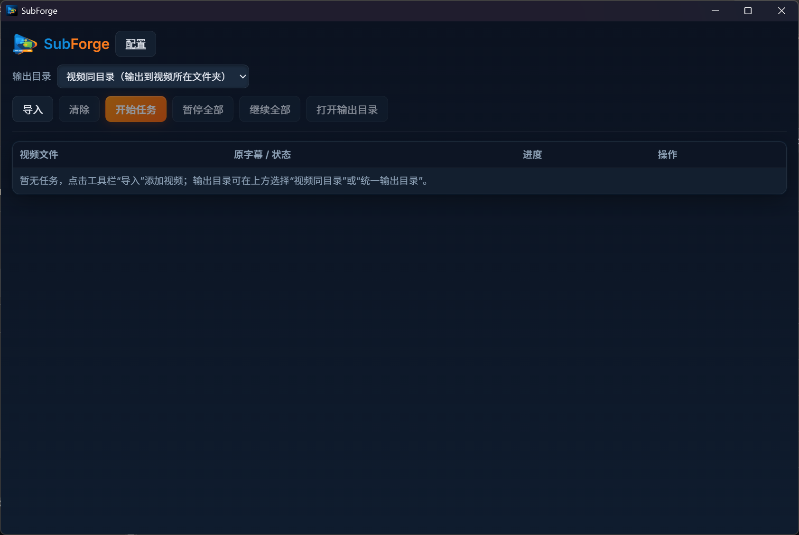

<p align="center">
  <picture>
    <source media="(prefers-color-scheme: dark)" srcset="./public/logo-2.png">
    
  </picture>
</p>

<h1 align="center">SubForge</h1>

<p align="center">
  一个面向本地视频的桌面字幕提取、分段与翻译工具。
</p>

<p align="center">
  <a href="./README.md">English</a>
</p>

<p align="center">
  
  
  
  
</p>



## SubForge 是什么？

SubForge 是一个基于 Tauri 的桌面应用，用于把本地视频转换为 `.srt` 字幕。它围绕真实批量处理流程设计，整合了本地 `whisper.cpp` 转写、可选 VAD 预处理、字幕分段，以及基于 OpenAI 兼容接口的可选翻译能力。

当前实现以 Windows 为主，并采用便携式目录布局：运行时、模型、配置、日志和任务缓存都会保存在应用目录旁边。

## 功能亮点

- 基于 `whisper.cpp` 的本地字幕提取
- 支持批量导入视频与任务队列管理
- 应用内下载和管理 Whisper 模型
- 支持 GPU 检测与可选 GPU 推理
- 可选 VAD，改善片头音乐、长静音场景下的时间轴问题
- 可配置的原字幕分段策略
- 翻译可完全关闭，也可切换到 OpenAI 兼容 LLM，或实验性的 Google Web 模式
- 三种字幕输出方式：
  - 仅原文字幕
  - 原文字幕和译文字幕两个文件
  - 单文件双语 `.srt`
- 便携式目录结构，API Key 加密保存

## 截图

当前主界面围绕批量处理设计：选择输出目录、导入视频、开始或暂停任务，并在同一张表格里查看原字幕和译文字幕进度。

## 快速开始

### 克隆仓库

```bash
git clone https://github.com/CodedByLiu/SubForge.git
cd SubForge
```

### 环境要求

- Node.js 20+
- Rust stable toolchain
- Tauri 2 在 Windows 下的构建环境
- `ffmpeg` 已加入 `PATH`，或在设置页中显式指定路径

说明：

- 如果没有配置 `whisper-cli`，SubForge 可以在 Windows 上自动准备托管版 `whisper.cpp` 运行时。
- Whisper 模型权重在应用内下载。
- 开启 VAD 时，应用也会自动准备所需的 VAD 模型。

### 开发运行

```bash
npm install
npm run tauri dev
```

### 生产构建

```bash
npm install
npm run tauri build
```

## 工作流程

1. 导入一个或多个本地视频。
2. 选择字幕输出到视频同目录，或输出到统一目录。
3. 在设置页中配置转写、分段、翻译和运行参数。
4. 启动任务队列。
5. SubForge 执行以下流水线：

```text
video -> ffmpeg -> VAD（可选） -> whisper.cpp -> 分段 -> 翻译（可选） -> .srt 输出
```

## 项目结构

```text
src/                 React 前端界面
src-tauri/           Rust 后端、Tauri 容器、任务流水线
docs/images/         README 图片资源
public/              应用 logo 资源
specs/               产品与实现说明
```

## 便携式运行目录

运行时 SubForge 会创建并使用类似以下结构：

```text
<app-dir>/
  bin/
  config/
  data/
  logs/
  models/whisper/
  temp/
```

这样做的目的是让应用自包含，便于整体移动、拷贝和分发。

## 当前能力

- 任务导入、开始、暂停、继续、删除、清空
- 任务配置快照，保证运行中的任务不会被全局配置改写
- CPU、内存、GPU 与 Whisper 推荐模型档位检测
- Whisper 模型目录：`tiny`、`base`、`small`、`medium`、`large-v3`
- 分段策略：
  - `disabled`
  - `auto`
  - `rules_only`
  - `llm_preferred`
- 翻译引擎：
  - `none`
  - `llm`
  - `google_web`（实验性）

## 后续方向

- 更完善的打包与发布流程
- 更完整的转写依赖校验与恢复
- 更细致的任务诊断和错误提示
- 持续优化分段和翻译质量

## 说明

- 当前仓库还没有加入正式的 License 文件。
- 自动托管 `whisper.cpp` 运行时目前以 Windows 为主。
- 实验性的 Google Web 翻译可能会因为上游变化而失效。

