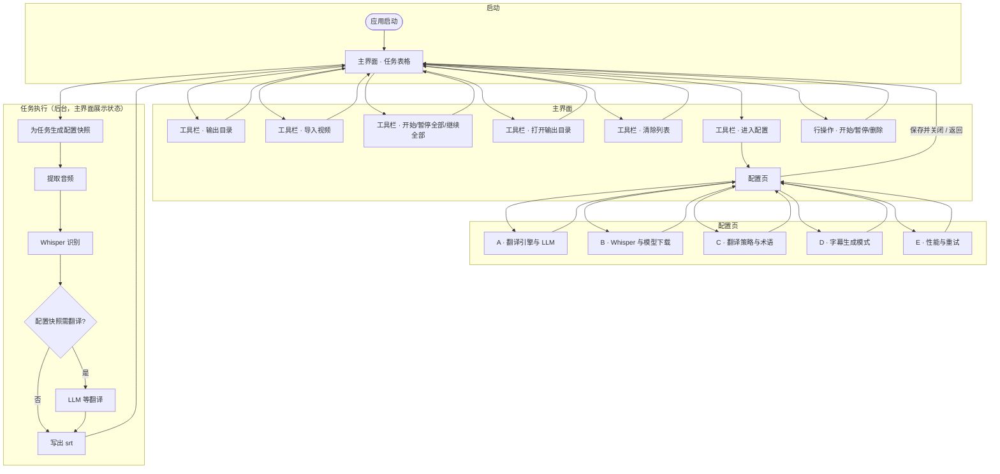
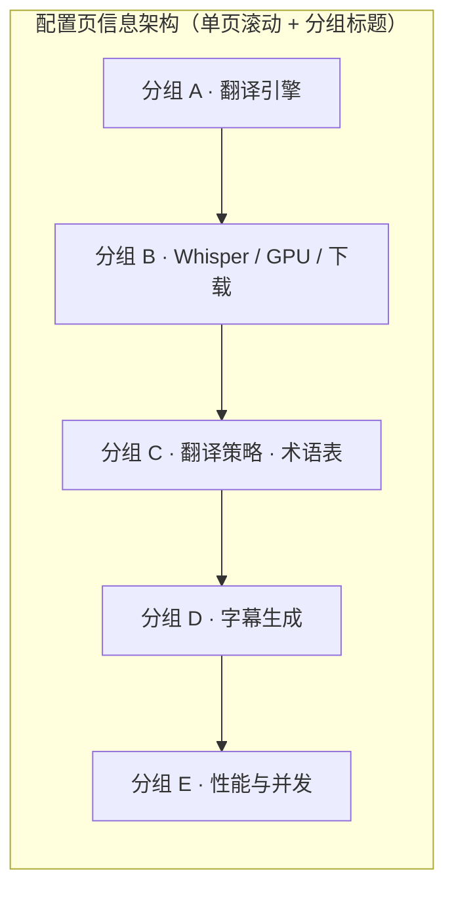

# 视频字幕提取与翻译桌面软件规格说明

## 1. 文档信息

- 文档编号：`0001`
- 文档名称：视频字幕提取与翻译桌面软件规格说明（桌面端）
- 目标形态：基于 `Rust + Tauri 2` 的跨平台桌面应用
- 核心能力：本地视频转写、可选字幕翻译、字幕文件生成、任务批处理、模型下载与配置

## 2. 产品目标

开发一个桌面软件，面向需要从视频中提取字幕并按需翻译字幕的用户，支持：

- 导入单个或多个视频文件
- 使用 Whisper 模型进行语音转字幕
- 支持仅提取原字幕，不启用翻译
- 支持使用可配置翻译引擎进行字幕翻译
- 支持原文字幕、原文+翻译双文件、单文件双语字幕三种生成方式
- 提供批量任务表格视图
- 提供模型下载、镜像配置、术语配置、性能自适应并发配置

## 3. 目标用户

- 需要处理英语视频并生成中文字幕的个人用户
- 需要批量整理课程、访谈、播客、录屏视频字幕的内容工作者
- 对国内网络环境友好、有本地模型下载需求的用户

## 4. 范围定义

### 4.1 本期范围

- 本地桌面端 UI
- 本地文件导入与任务管理
- Whisper 模型管理与下载（模型文件存放于软件目录下 `models/whisper/`）
- Whisper 推理是否使用 GPU 的可配置项；检测到可用 GPU 时默认启用 GPU 推理
- 模型下载/管理界面展示本机 GPU 信息与推荐模型档位
- 翻译引擎配置（含 LLM `Base URL` / `API Key` / 模型名的连通性测试）
- 字幕提取、可选翻译、导出
- GPU/CPU 能力探测与自动并发
- 任务暂停、继续、删除、清空

**首版正式交付能力（与 §15 对齐）**：`翻译关闭`、`LLM（OpenAI 兼容接口）`、三种字幕输出、`srt`、术语表、Whisper 单后端路径。`Google Web 免费模式（和LLM可以切换选择）`。

### 4.2 暂不纳入本期

- 云端账号体系
- 在线项目协作
- 视频内嵌硬字幕回写
- 时间轴可视化手动校对编辑器
- 音频降噪、说话人分离、章节分析
- OCR 提取画面内嵌字幕

## 5. 核心使用流程

1. 用户打开软件。
2. 用户进入配置页，设置：
  - 翻译引擎类型
  - 字幕生成方式（是否走翻译由 **§6.2「配置优先级」** 统一推导）
  - 可选的 LLM `Base URL`、`API Key`、模型名；配置后可点击 **连接测试** 验证是否可达
  - Whisper：模型类型、下载镜像；**是否使用 GPU**（有可用 GPU 时默认勾选）
  - 在模型下载/管理区域查看本机 GPU 型号、显存及 **推荐 Whisper 档位**
  - 翻译语言方向（含与识别语言的协调规则见 §7.3）
  - 专业术语表
3. 用户在主界面工具栏选择输出目录。
  - 默认使用视频所在目录
  - 用户也可手动指定统一输出目录
4. 用户在主界面点击“导入”，选择一个或多个视频文件。
5. 导入后，任务显示在表格中。
6. 用户点击“开始任务”，系统根据硬件能力自动安排并发执行。
7. 系统对每个视频执行：
  - 音频抽取
  - 语音识别生成原字幕
  - 按配置决定是否翻译
  - 生成对应字幕文件
8. 用户可在任务过程中暂停、继续或删除任务。
9. 完成后，字幕文件输出到指定目录；若已存在同名字幕文件，则直接覆盖。

## 6. 页面与模块设计

### 6.0 界面流程图与线框

本节用 **Mermaid** 描述界面间跳转与主操作路径，用 **ASCII** 描述窗口分区布局（实现可用组件库微调，以信息架构一致为准）。

#### 6.0.1 界面流程图（Mermaid）







#### 6.0.2 主界面线框（ASCII）

```text
+================================================================================+
|  SubForge - 字幕提取                                                    _  []  X |
+================================================================================+
| 输出目录: [ 视频同目录 (每个文件输出到其所在文件夹)          v ]  [ 浏览... ]   |
|--------------------------------------------------------------------------------|
| [ 导入 ] [ 清除 ] | [ 开始任务 ] [ 暂停全部 ] [ 继续全部 ] | [ 打开输出目录 ]   |
|                                                        [ ⚙ 配置 ]              |
+================================================================================+
| 视频文件            | 原字幕 / 状态     | 翻译 / 状态   | 进度      | 操作      |
|---------------------|-------------------|---------------|-----------|-----------|
| course_ep01.mp4     | 待开始            | -             | 0%        | 开始 暂停 删除 |
| interview_zh.mkv    | 识别中...         | -             | 38%       | 开始 暂停 删除 |
| podcast_042.mp4     | 已完成            | 已完成        | 100%      | 开始 暂停 删除 |
| broken.avi          | 失败: 无音轨      | -             | --        | 开始 暂停 删除 |
+================================================================================+
| 状态栏: 就绪 | GPU: NVIDIA xxx 8GB | Whisper: medium | 并发: 2                    |
+================================================================================+
```

说明：第三列在「不翻译」任务行显示 `-`；表头可保留「翻译 / 状态」以统一列宽（见 §6.1）。状态栏为可选增强，用于硬件与当前模型摘要。

#### 6.0.3 配置页线框（ASCII）

```text
+================================================================================+
|  设置 - SubForge                                                         _  []  X |
+================================================================================+
|  [ 保存 ]   [ 取消 ]                                                             |
+================================================================================+
|                                                                                  |
|  --- A. 翻译引擎 -------------------------------------------------------------  |
|  引擎: [ LLM                              v ]                                    |
|  源语言: [ auto v ]    目标语言: [ zh v ]                                        |
|  超时(秒): [ 60 ]  最大重试: [ 3 ]  翻译并发: [ 2 ]                              |
|  Base URL: [ https://api.example.com/v1______________________________ ]          |
|  API Key:  [ •••••••••••••••••••••••••••••••••••••••••••••••••••• ]              |
|  模型名称: [ gpt-4o-mini____________________________________ ]  [ 连接测试 ]    |
|  (测试结果: 未测试 / 成功 / 失败原因一行)                                        |
|                                                                                  |
|  --- B. Whisper --------------------------------------------------------------  |
|  [v] 使用 GPU 进行识别（推荐）    本机 GPU: NVIDIA RTX 4060  8GB 显存            |
|  推荐模型: small ~ medium（仅供参考，可按实际速度调整）                          |
|  识别语言: [ 自动检测 v ]                                                        |
|  模型: [ medium v ]   镜像: [ https://mirror.example/whisper____ ]  [ 下载 ]   |
|  已下载: base, small   [ 查看已下载 ]  [ 删除所选 ]                              |
|                                                                                  |
|  --- C. 翻译策略 -------------------------------------------------------------  |
|  风格: [ 术语优先 v ]   每段最大字符: [ 800 ]   [v] 保留原文专有名词             |
|  术语表: [ 导入 ] [ 导出 ]     + 添加行  (表格: 原文 | 译文 | 备注)              |
|                                                                                  |
|  --- D. 字幕生成 -------------------------------------------------------------  |
|  ( ) 仅原文字幕   ( ) 原文字幕 + 译文字幕(两个文件)   (*) 单文件双语 srt        |
|                                                                                  |
|  --- E. 性能与运行 -----------------------------------------------------------  |
|  [v] 自动检测硬件并设置并发    最大并发任务数: [ 2 ]（或自动）                   |
|  CPU 线程上限: [ 8 ]   任务失败后自动重试: [ 0 ] 次                              |
|                                                                                  |
+================================================================================+
```

可选布局：配置页亦可用 **左侧垂直导航**（翻译 / Whisper / 策略 / 字幕 / 性能）切换分组，右侧为表单；信息字段与上图一致。

### 6.1 主界面

主界面采用表格布局。

#### 顶部工具栏

- `输出目录`：用于选择当前批次任务的输出目录，默认值为“视频同目录”
- `导入`：支持单选或多选视频文件
- `清除`：清空当前任务列表；若存在运行中任务，须先取消后台处理或禁止清除并提示，避免孤儿进程（首版推荐：**有运行中任务时禁用清除或二次确认后先全部取消**）
- `开始任务`：开始所有待处理任务
- 可补充：
  - `暂停全部`
  - `继续全部`
  - `打开输出目录`
  - `配置`

输出目录规则：

- 默认输出到每个视频文件所在目录
- 用户可在工具栏手动指定一个统一输出目录
- 该输出目录作用于当前任务批次
- 如果目标位置已存在同名字幕文件，直接覆盖，不追加编号，不弹二次命名

任务配置生效规则：

- 主界面当前配置属于“待开始任务的默认配置”
- 当用户点击 `开始任务` 或行内 `开始` 时，系统为对应任务生成一份**配置快照**
- 配置快照至少包含：字幕模式、翻译引擎、源/目标语言、Whisper 模型、是否使用 GPU、输出目录、术语表版本、翻译风格、重试参数
- 任务进入执行后，后续修改全局配置**不影响该任务**
- 若用户希望待开始任务改用新配置，可直接修改后再开始
- 若用户希望已暂停或失败任务改用新配置，需显式执行“重新应用当前配置”或删除后重新导入

#### 任务表格列

- 第一列：视频文件名
- 第二列：原字幕摘要/状态显示
- 第三列：翻译字幕摘要/状态显示
- 第四列：进度
- 第五列：操作

第三列显示规则：

- 当任务配置快照判定不执行翻译时（仅原文字幕模式或翻译引擎为 `关闭`），该行第三列显示为隐藏态或 `-`
- 当任务配置快照判定执行翻译时，第三列显示翻译摘要、翻译状态或翻译错误
- 若当前任务列表中同时存在“翻译开启”和“翻译关闭”的任务，表头第三列仍保留，未翻译的行显示 `-`

#### 每行任务操作

- `开始`：待开始/已暂停/失败后可用；与工具栏「继续全部」语义一致（**继续即对暂停项再次开始**）
- `暂停`
- `删除`

建议补充状态字段，至少包含：

- `待开始`
- `排队中`
- `暂停请求中`
- `提取音频中`
- `识别中`
- `翻译中`
- `已暂停`
- `已完成`
- `失败`

### 6.2 配置页面

配置页建议分为以下几个分组。

#### 配置优先级（避免状态冲突）

以下规则为**唯一真相**，UI 可用单选/联动隐藏减少重复项：

1. **是否执行翻译**：当且仅当 `字幕生成配置` 不是「仅生成原文字幕」**且** `翻译引擎` 不为 `关闭` 时，流水线才调用翻译；否则不请求翻译，并按 §6.1 的行级显示规则处理第三列。
2. **不再单独使用「是否启用翻译」与引擎/模式打架**：若需简化界面，可省略「是否启用翻译」，完全由「字幕模式 + 翻译引擎」推导；若保留该开关，则须实现为与上式等价（关闭时等价于引擎 `关闭` 或强制视为不翻译）。
3. **任务执行以配置快照为准**：配置页与工具栏中的当前值只影响尚未开始的任务；已开始、已暂停、失败待重试的任务继续沿用其启动时的配置快照。

#### A. 翻译引擎配置

- `翻译引擎`
- `源语言`（翻译侧；与 Whisper 识别语言的关系见 §7.3）
- `目标语言`
- `请求超时`
- `最大重试次数`
- `并发翻译请求数`
- `连接测试` 按钮（见下）

翻译引擎建议支持：

- `关闭（仅提取原字幕）`
- `LLM`
- `Google Web 免费模式（实验性）`（首版非必交付，见 §4.1）

说明：

- 当翻译引擎为 `关闭` 时，不显示或不校验 LLM 专属字段。
- 当翻译引擎为 `关闭` 时，翻译策略分组默认折叠或禁用；**Whisper 识别语言**在 Whisper 配置区配置（见 §6.2 B）。
- `LLM` 需兼容 **OpenAI 风格 HTTP API**（见下文「多厂商 LLM」）。
- `Google Web 免费模式` 如采用非官方网页接口适配，须标记实验性；使用风险与合规由用户在 UI 提示中知悉。
- 后续可扩展 Google Cloud Translation 等。

##### 多厂商 LLM（豆包、DeepSeek、Claude、OpenAI 等）如何「动态切换」

- **技术实质**：各厂商若提供与 **OpenAI Chat Completions（或兼容的 Responses）** 一致的 HTTPS 接口，客户端只需一套 **HTTP 调用**（统一请求体字段如 `model`、`messages`），通过改三项配置即可切换供应商与模型：
  - `**Base URL`**：该厂商文档中的 API 根地址（如官方 `https://api.openai.com/v1`、或各云/OpenRouter 等给定 endpoint）。
  - `**API Key**`：该厂商发放的密钥。
  - `**模型名称**`：该厂商定义的模型 ID（如 `gpt-4o-mini`、`deepseek-chat` 等）。
- **不需要**在应用内为每家单独集成专用 SDK 即可完成「换 Base URL + Key + 模型名」切换；若某厂商 API 与 OpenAI 字段不完全一致，可在适配层做最小映射，仍归在「LLM 引擎」下。
- **连接测试**：使用当前填写的 `Base URL`、`API Key`、`模型名称` 发起一次**轻量请求**（例如拉取模型列表、或发送极简 completion），根据 HTTP 状态与响应体判断成功/失败，在界面展示明确文案（成功/鉴权失败/网络不可达/模型不存在等）。**不在日志中输出完整 Key**。

当翻译引擎选择 `LLM` 时，显示以下附加字段：

- `Base URL`
- `API Key`
- `模型名称`

当翻译引擎选择 `Google Web 免费模式（实验性）` 时，建议显示以下附加字段：

- `服务地址`（可选，默认内置）
- `是否启用代理`
- `QPS/请求间隔限制`
- `实验性说明`

#### B. Whisper 配置

- `模型类型` 选择
- `**使用 GPU 进行 Whisper 推理`**：开关；启动时检测推理后端与 GPU，**若存在可用 GPU 且后端支持 GPU，则默认开启**；用户可强制改为 CPU（便于排障或省电）
- **识别语言**（供 Whisper；可选 `自动检测`；若用户指定，则覆盖自动检测参与转写）
- `模型下载地址` / `下载镜像地址`
- `下载按钮`
- `删除本地模型`
- `查看已下载模型`

模型类型建议至少支持：

- `tiny`
- `base`
- `small`
- `medium`
- `large-v3`

**模型下载/管理界面（硬件与推荐）**：

- 展示本机检测到的 **GPU 型号**、**显存大小**（若无可显示「未检测到可用 GPU，将使用 CPU」）。
- 根据显存与可选的「是否启用 GPU」给出 **推荐 Whisper 档位**（示例规则，实现可微调并在界面注明「仅供参考」）：
  - 无 GPU 或用户关闭 GPU：推荐 `tiny`～`base`，视 CPU/内存可适当建议 `small`
  - 显存 **小于 4GB**：推荐 `base` 或 `small`
  - **4GB～8GB**：推荐 `small` 或 `medium`
  - **大于 8GB**：可推荐 `medium` 或 `large-v3`
- 仍显示各档 **模型大小、预计下载时间、磁盘占用**。

说明：

- 默认优先使用国内镜像；允许用户手动改写镜像地址。
- Whisper 模型文件统一存放在 **软件目录** `<app_dir>/models/whisper/`（首版在软件目录下新建并沿用该结构，见 §8.3）。

#### C. 翻译策略配置

- `翻译风格`
- `专业术语表`
- `每段最大字符数`
- `是否保留原文专有名词`

显示规则：

- 当不执行翻译时（§6.2 配置优先级：仅原文字幕或引擎 `关闭`），该分组默认隐藏或禁用
- 当翻译引擎为 `LLM` 或 `Google Web 免费模式（实验性）` 且会执行翻译时，该分组显示

翻译风格建议支持：

- `直译`
- `自然表达`
- `术语优先`

#### D. 字幕生成配置

支持以下三种模式：

1. `仅生成原文字幕`
  - 只生成原文字幕文件
  - 不调用翻译
  - 主界面第三列“翻译字幕”默认隐藏
2. `生成原文字幕和翻译字幕两个文件`
  - 生成原文字幕文件
  - 生成目标语言字幕文件
  - 主界面显示第三列
3. `生成单文件双语字幕`
  - 一个字幕文件内，每个时间片两行
  - **第一行：目标语言译文**；**第二行：源语言原文**（与 §7.5 示例一致；不限于中英）
  - 主界面显示第三列

建议补充：

- 首版输出格式固定为 `srt`
- 输出目录不放在配置页，改为主界面工具栏选择
- 若目标位置已存在同名文件，直接覆盖

#### E. 性能与运行配置

- `自动检测硬件并设置并发`
- `手动指定最大并发任务数`
- `CPU 线程数上限`（CPU 推理或与 Whisper 线程相关的上限，与 §6.2 B 的 Whisper GPU 开关配合）
- `任务失败后自动重试`：**默认关闭或有限次数**（如最多 2 次，可配置），区分失败类型（网络类可重试，文件损坏不重试）

说明：Whisper 是否走 GPU **以 §6.2 B 开关为准**；本节不再重复「优先 GPU」以免与 Whisper 项歧义（若全局另有非 Whisper 的 GPU 用途再单独增加）。

## 7. 功能需求

### 7.1 文件导入

- 支持导入单个视频文件。
- 支持导入多个视频文件。
- 支持常见视频格式：
  - `mp4`
  - `mkv`
  - `mov`
  - `avi`
  - `webm`
- 对重复导入的同一路径文件，需提示或忽略重复项。
- **统一输出目录下的文件名冲突**：不同目录的同名视频（如均为 `a.mp4`）输出会争夺同一 `<basename>_<lang>.srt`。首版规则：在统一输出目录模式下，文件名追加 **源视频路径的稳定短哈希**（如 8 位十六进制）于扩展名前，例如 `a_a1b2c3d4_en.srt`；**视频同目录**模式仍以视频所在目录区分，一般无需哈希。

### 7.2 音频抽取

- 系统需要从视频中抽取音频供 Whisper 识别。
- 依赖 `ffmpeg`。
- 若本机缺失 `ffmpeg`：启动时检查；**首版**以清晰错误提示 + **安装指引**为主；可选后续版本再提供自动下载/捆绑，不在首版验收中强制。

### 7.3 语音识别

- 使用 Whisper 对音频内容进行识别。
- **设备**：遵循配置项 **「使用 GPU 进行 Whisper 推理」**；若开启但运行时 GPU 不可用，应降级 CPU 并提示（或按产品选择阻止开始任务）。
- 应支持自动语言检测。
- **识别语言配置**：在 Whisper 配置区设置（`自动` 或具体语言代码）。若用户指定具体语言，转写以该语言为准；**翻译侧「源语言」** 在 `自动` 时可与识别结果语言一致，若用户将翻译源语言设为固定值，则以翻译配置为准做译出（识别仍为 Whisper 配置负责，避免混在同一字段）。
- 输出需包含：
  - 时间戳
  - 文本内容

### 7.4 翻译

- 当用户选择“仅原文字幕”时，不触发翻译。
- 当翻译引擎为 `关闭` 时，仅执行转写与原字幕导出。
- 当用户启用翻译且引擎为 `LLM` 时，使用配置的 LLM 对识别结果逐段翻译。
- 当用户启用翻译且引擎为 `Google Web 免费模式（实验性）` 时，使用对应适配器逐段翻译。
- 翻译必须保持与原字幕时间轴对齐。
- **术语表**：应用规则与 §10 一致——**整词匹配**、可选 **区分大小写**；命中术语时 **优先替换/约束译文**，再执行通用翻译提示词；未命中则走常规模型翻译。
- **首版翻译批次**：按若干连续字幕条成批发送（非逐条独立请求），**带前后文窗口**；保持片段编号与时间轴映射，避免错位（见原 §14.5，现升为功能要求）。

翻译错位与回退规则：

- 若翻译返回的片段数量、编号或顺序与输入批次不一致，该批次判定为失败，不直接写入结果
- 系统必须先对该批次执行有限次重试
- 若重试后仍不一致，必须自动回退为更小批次或逐条翻译
- 若逐条翻译后仍失败，则该片段保留原文，并在任务详情中标记“翻译失败，已回退原文”
- 任何情况下不得因为单个批次错位而破坏整份字幕的时间轴对应关系

翻译引擎规则：

- `关闭`：不显示翻译结果列，不触发任何翻译请求
- `LLM`：支持自定义 `Base URL`、`API Key`、模型名称
- `Google Web 免费模式（实验性）`：不依赖 LLM Key，但可能受限流、接口变动、验证码、区域网络限制影响

首版实现建议：

- 核心稳定路径优先支持 `关闭 + LLM`
- `Google Web 免费模式（实验性）` 作为可插拔适配层接入
- UI 上必须明确标注实验性和不保证可用性

建议补充翻译策略：

- 长段落自动切分
- 多段批量翻译
- 翻译失败自动重试
- 单段失败时保留原文并标记异常

### 7.5 字幕导出

需要支持三类导出结果：

#### 模式 1：仅原文字幕

- 如果原文是英文，输出文件名：`<视频文件名>_en.srt`
- 如果原文是中文，输出文件名：`<视频文件名>_zh.srt`
- 其他语言可扩展：`_<语言代码>`
- 输出路径默认为视频所在目录，或用户在工具栏选择的统一输出目录
- 如已存在同名文件，直接覆盖

#### 模式 2：原文字幕 + 翻译字幕两个文件

- 原文文件：`<视频文件名>_en.srt` 或 `_<源语言代码>.srt`
- 翻译文件：`<视频文件名>_zh.srt` 或 `_<目标语言代码>.srt`
- 输出路径默认为视频所在目录，或用户在工具栏选择的统一输出目录
- 如已存在同名文件，直接覆盖

#### 模式 3：单文件双语字幕

- 输出文件：`<视频文件名>.srt`
- 输出路径默认为视频所在目录，或用户在工具栏选择的统一输出目录
- 如已存在同名文件，直接覆盖
- 每个字幕片段格式：

```text
1
00:00:01,000 --> 00:00:03,000
目标语言译文示例
源语言原文示例
```

注意：

- 双语文件名为 `<视频文件名>.srt`，不加语言后缀；**统一输出目录**下若发生同名视频冲突，同样适用 §7.1 的短哈希规则。
- 显示顺序固定为：**上行目标语言、下行源语言**（与 §6.2 D 一致）。

### 7.6 任务管理

- 支持单任务开始。
- 支持批量开始全部任务。
- 支持暂停任务。
- 支持删除任务。
- 删除已完成任务时，不删除已生成字幕文件。
- 删除进行中任务时，需要先安全取消底层处理进程。

**首版暂停语义（已定）**：

- 采用 **软暂停**：任务标记为「暂停请求中」，在当前阶段（如当前音频段/当前推理步）**边界**结束后再停止后续阶段；不保证推理库内部可瞬时中断。
- 暂停后用户可点击 **开始** 继续（等同「继续」）；工具栏 **继续全部** 恢复所有已暂停项。

### 7.7 进度显示

进度列建议显示：

- 百分比
- 当前阶段
- 错误信息入口

进度计算建议：

- 音频抽取：10%
- 识别：50%
- 翻译：30%
- 导出：10%

说明：

- 若只生成原文字幕，应跳过翻译阶段并重新分配进度。
- 当翻译引擎关闭时，建议进度改为：
  - 音频抽取：15%
  - 识别：75%
  - 导出：10%

## 8. 数据与配置设计

### 8.1 本地配置项

建议保存到本地配置文件，字段示例：

```json
{
  "llm": {
    "base_url": "",
    "api_key": "",
    "model": "",
    "timeout_sec": 60,
    "max_retries": 3,
    "translate_concurrency": 2
  },
  "translator": {
    "engine": "none",
    "provider_url": "",
    "use_proxy": false,
    "min_request_interval_ms": 1000,
    "experimental_acknowledged": false
  },
  "whisper": {
    "model": "base",
    "use_gpu": true,
    "recognition_lang": "auto",
    "download_url": "",
    "mirror_url": "",
    "prefer_mirror": true
  },
  "translate": {
    "source_lang": "auto",
    "target_lang": "zh",
    "style": "term_first",
    "glossary": [
      { "source": "token", "target": "令牌" }
    ]
  },
  "subtitle": {
    "mode": "bilingual_single",
    "format": "srt",
    "output_dir_mode": "video_dir",
    "custom_output_dir": "",
    "overwrite": true
  },
  "runtime": {
    "auto_detect_hardware": true,
    "max_parallel_tasks": 2,
    "cpu_thread_limit": 8,
    "task_auto_retry_max": 0
  }
}
```

说明：

- `translator.engine` 与 `subtitle.mode` 共同决定是否调用翻译，遵循 §6.2「配置优先级」。
- 应用采用**严格便携模式**：`API Key` 不使用系统凭据存储，改为加密后保存在软件目录下。
- `llm.api_key` **不得明文写入** `app-config.json`；建议配置文件中仅保存密文引用，实际密文保存在 `<app_dir>/config/secrets.enc.json` 或等价加密文件中。
- 复制整个软件目录时，模型、配置和加密后的 Key 可一并迁移；但 UI 需提示“加密存储不等于绝对安全”。

### 8.2 任务数据结构

建议每个任务至少包含：

- 任务 ID
- 视频绝对路径
- 文件名
- 文件大小
- 视频时长
- 当前状态
- 当前进度
- 当前翻译引擎
- 配置快照 ID
- 配置快照摘要
- 原文字幕缓存路径
- 翻译字幕缓存路径
- 输出文件路径
- 错误信息
- 创建时间
- 更新时间

### 8.3 本地目录结构

模型、配置和软件运行产生的数据统一存放在软件目录下。

建议目录结构：

```text
<app_dir>/
  app.exe
  models/
    whisper/
  config/
    app-config.json
    secrets.enc.json
  data/
    glossary.json
    tasks-cache.json
  logs/
  temp/
```

规则说明：

- Whisper 模型下载到 `<app_dir>/models/whisper/`
- 应用配置保存到 `<app_dir>/config/app-config.json`
- 加密后的敏感配置保存到 `<app_dir>/config/secrets.enc.json`
- 术语表、任务缓存等业务数据保存到 `<app_dir>/data/`
- 临时音频和中间字幕文件保存到 `<app_dir>/temp/`
- 日志保存到 `<app_dir>/logs/`

实现边界：

- 首版约定：软件以**可写目录**分发（如便携解压目录）；模型、配置、缓存、加密后的敏感信息均位于软件目录下，**在软件目录下新建 `models/whisper/`** 存放 Whisper 权重。若未来提供安装包，再单独约定安装版数据目录；本文不展开。

## 9. 性能与并发策略

### 9.1 自动硬件检测

软件启动时应检测（结果供并发策略与 **Whisper 模型推荐 UI** 使用）：

- CPU 核心数
- 可用内存
- GPU 是否可用、**GPU 型号名称**、**显存大小**
- 当前 Whisper 推理后端是否支持 GPU（如 CUDA/ROCm/Metal 等与所选实现相关，首版可只覆盖实际捆绑的一种后端并在 UI 说明）

### 9.2 默认并发策略

建议规则：

- 低配机器：
  - 单任务串行
- 中配机器：
  - 2 个任务并发
- 高配机器且有可用 GPU：
  - 2 到 4 个任务并发

但需要限制：

- Whisper 推理和翻译请求不应无限并发
- 必须分别限制：
  - 视频任务级并发
  - 翻译请求级并发

### 9.3 实现建议

- 优先保证稳定，不要一开始就激进并发。
- 建议默认自动模式上限为 `2`，避免普通电脑卡死。
- 允许高级用户手动覆盖自动策略。

## 10. 专业术语表需求

术语表应支持：

- 手工新增
- 手工编辑
- 手工删除
- 批量导入

术语表字段建议：

- 原文术语
- 目标语言术语
- 备注

建议补充：

- 区分大小写
- 整词匹配
- 导入导出 `csv/json`

## 11. 错误处理与边界条件

以下边界需要在规格中明确，否则开发阶段容易返工。

### 11.1 输入边界

- 视频无音轨
- 视频文件损坏
- 路径包含中文、空格、特殊字符
- 超大视频文件
- 重复文件名但不同目录

### 11.2 模型边界

- 模型下载中断
- 镜像地址不可用
- 本地模型文件损坏
- 已下载模型与当前推理后端不兼容
- 软件目录无写权限导致模型无法下载

### 11.3 翻译引擎边界

- Base URL 不可访问
- API Key 错误
- 模型名不存在
- 请求限流
- 响应格式异常
- 翻译超时
- Google Web 免费模式接口变更
- Google Web 免费模式触发验证码、封禁或区域限制
- 免费翻译接口结果格式变化导致解析失败

### 11.4 任务控制边界

- 任务运行中点击删除
- 任务暂停后关闭程序
- 程序崩溃后是否恢复未完成任务（首版：**不自动恢复队列**，见 §14.3）
- 批量任务中单个任务失败是否影响其他任务（**不得**因单任务失败退出进程或中止其余任务；错误写入该任务状态）

### 11.5 输出边界

- 输出文件已存在
- 输出目录无写权限
- 同时生成多个同名结果
- 字幕片段为空文本

当前产品规则：

- 若输出文件已存在，直接覆盖
- 不做自动改名，不保留历史副本
- 同一个视频多次运行，以最后一次成功输出的结果覆盖前一次结果

## 12. 非功能需求

### 12.1 易用性

- 配置项分组清晰
- 默认配置可直接运行
- 国内用户默认走镜像下载
- 用户可以完全关闭翻译，仅使用字幕提取能力
- 当翻译关闭时，界面不显示无意义的翻译列和翻译配置项
- 输出目录在主界面工具栏直接选择，减少来回切换配置页

### 12.2 性能

- 任务列表至少支持 100 个任务不卡顿
- UI 操作不能因后台转写阻塞

### 12.3 稳定性

- 单任务失败不应导致整个程序退出
- 异常需有可读错误提示
- 临时文件应可清理

### 12.4 安全性

- `API Key` 采用**加密落盘到软件目录**的方式保存，`**app-config.json` 中不保存明文 Key**（见 §8.1、§8.3）；界面输入框可掩码显示。
- 日志中不得打印完整 `API Key`。

### 12.5 可维护性

- 转写模块、翻译模块、下载模块、任务调度模块分层。
- 核心流程边界清晰，关键外部依赖（HTTP、ffmpeg、推理）**可替换、可 mock**，便于联调与排障。

## 13. 推荐技术实现方向

本节为建议，不强制绑定。

### 13.1 客户端

- `Tauri 2`
- 前端可选：
  - `React`
  - `Vue`
  - `Svelte`

### 13.2 后端核心

- `Rust`
- 任务调度：`tokio`
- 配置存储：`serde + toml/json`
- 本地数据库可选：`sqlite`

### 13.3 音视频处理

- `ffmpeg`

### 13.4 Whisper 接入

可选路线：

- 调用本地可执行推理引擎
- Rust 绑定现有 Whisper 推理库

建议优先选一个工程风险更低的方案，不要首版同时支持太多后端。

### 13.5 翻译引擎接入

- 采用统一翻译适配层接口
- `LLM` 路径兼容 OpenAI 风格 HTTP API
- `Google Web 免费模式（实验性）` 走独立适配器，不与 LLM 参数耦合
- 后续可扩展多服务商适配层

## 14. 建议补充但你当前描述里还没完全定下来的点

这些建议最好在开发前拍板。

### 14.1 输出格式

首版固定只支持：

- `srt`

不提供格式切换。

### 14.2 输出目录规则

已明确为：

- 默认输出到视频同目录
- 用户可在主界面工具栏选择统一输出目录
- 如存在同名文件，直接覆盖

### 14.3 失败恢复

建议明确是否需要：

- 程序重启后恢复任务队列
- 从中间结果继续，而不是整段重跑

如果首版想先降低复杂度，可定义为：

- 程序关闭后未完成任务不自动恢复
- 已生成的中间结果可复用
- 已成功生成的最终字幕若再次运行同一视频，按当前覆盖规则直接被新结果替换

### 14.4 字幕编辑

你当前需求主要是自动生成，没有提到人工校对。
建议首版不做编辑器，只做导出前预览即可。

### 14.5 翻译上下文

已在 §7.4 定为首版功能要求（分批 + 上下文窗口 + 编号映射）。若首版工期不足，可退化为逐条翻译，但须在发布说明中注明质量风险。

### 14.6 免费翻译接口策略

如果你希望支持“Google 免费翻译”，建议提前定下产品策略：

- 是否接受该能力为实验性功能
- 是否允许因接口失效而临时不可用
- 是否在 UI 中明确提示“非官方、可能失效、可能限流”

建议首版定义为：

- `LLM` 是正式支持路径
- `关闭翻译` 是正式支持路径
- `Google Web 免费模式（实验性）` 是可选能力，不作为首版稳定承诺

## 15. 首版 MVP 建议

如果希望尽快落地，建议首版只做以下最小闭环：

- 导入视频
- Whisper 模型下载
- 单模型转写
- 支持仅提取原字幕
- OpenAI 兼容 LLM 翻译
- 三种字幕输出模式
- 固定 `srt` 输出
- 工具栏选择输出目录
- 任务表格
- 暂停/删除/开始
- 自动并发上限
- 术语表

以下内容可以放到后续版本：

- 多字幕格式
- 任务恢复
- 复杂下载源管理
- 手动字幕编辑
- 多后端推理适配
- `Google Web 免费模式（实验性）`

## 16. 验收标准

满足以下条件可视为首版达标：

1. 用户能成功配置 Whisper 下载源，并可按需配置翻译引擎。
2. 用户能导入一个或多个视频文件。
3. 用户能在主界面工具栏选择输出目录，默认值为视频同目录。
4. 用户能启动批量任务，并看到每个任务的状态和进度。
5. 软件能根据配置生成：
  - 仅原文字幕
  - 原文与翻译两个字幕文件
  - 单文件双语字幕
6. 当不执行翻译时（见 §6.2 配置优先级），不发起翻译请求；若当前任务列表全部为不翻译任务，则第三列隐藏；若存在混合任务，则未翻译的行第三列显示 `-`。
7. 输出文件统一为 `srt`，命名符合规则；如已存在同名文件，直接覆盖。
8. 模型、配置、加密后的敏感信息和运行数据按约定写入软件目录下的对应子目录。
9. 已开始任务持有独立配置快照；任务开始后修改全局配置，不影响该任务执行结果。
10. 常见错误场景下，界面能给出明确提示，不崩溃。
11. 在普通电脑上默认并发不会导致 UI 明显卡死。
12. **LLM**：填写 `Base URL`、`API Key`、`模型名称` 后，**连接测试**可返回明确成功或失败原因；日志无完整 Key，且 Key 不以明文存于 `app-config.json`。
13. **Whisper**：可配置 **使用 GPU**；无 GPU 时自动或提示使用 CPU；模型下载/管理区展示 **GPU 型号与显存**，并给出 **推荐模型档位**。
14. **统一输出目录** 下同名视频输出采用 §7.1 约定的 **短哈希** 防覆盖；**单任务失败** 不影响同批其他任务。
15. 批量翻译发生片段错位时，系统按“重试 -> 缩小批次或逐条翻译 -> 回退原文”的规则处理，不破坏时间轴映射。

## 17. 结论

规格已收敛以下拍板项：

- **存储**：首版采用**严格便携模式**；软件目录可写；`models/whisper/` 存权重；`API Key` 加密后放在软件目录；配置与数据路径见 §8.1、§8.3。
- `**ffmpeg`**：首版检测 + 安装指引（§7.2）。
- **暂停**：软暂停 + 阶段边界停止（§7.6）。
- **任务恢复**：首版不自动恢复队列（§14.3）。
- **配置生效**：任务在点击开始时冻结配置快照；开始后修改全局配置不影响该任务（§6.1、§6.2、§8.2）。
- **翻译**：分批与上下文、术语整词/大小写规则（§7.4、§10）。
- **首版范围**：正式路径为关闭翻译 + OpenAI 兼容 LLM；Google Web 非必交付（§4.1、§15）。
- **多厂商 LLM**：同一套 OpenAI 兼容 HTTP，换 Base URL / Key / 模型名（§6.2 A）。

后续可拆分为：

- `产品 PRD`
- `技术架构设计`
- `数据库/配置结构设计`
- `开发任务拆分`

